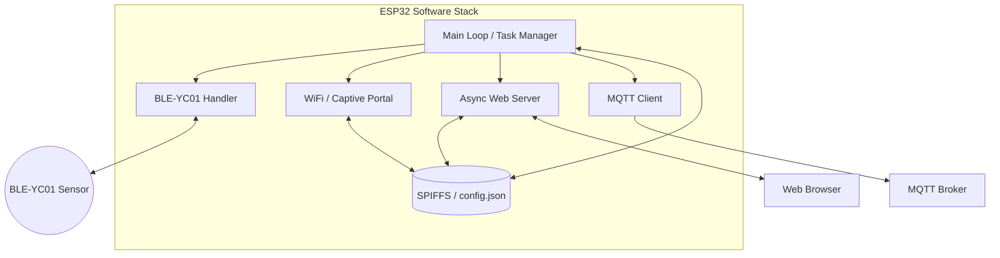

# Functional Specification Document (FSD) - Pool Sensor BLE-YC01

## 1. Overview

### 1.1 Purpose
The Pool Sensor BLE-YC01 system is designed to automate the monitoring of swimming pool water quality. By using an ESP32 to interface with a BLE-enabled sensor, it provides real-time data on critical chemical parameters, reducing the need for manual testing and ensuring a safer swimming environment through constant oversight.

BLE scanning and data retrieval from BLE-YC01 sensors, proprietary data decoding, WiFi connectivity (STA/AP), MQTT data publishing, web-based dashboard and configuration, and OTA updates.

## 2. Functional Summary

### 2.1 Main Workflow / Operating Modes
1. **Startup Mode:** Initializes filesystem, reads configuration, and attempts WiFi connection.
2. **Captive Portal Mode:** If WiFi fails, starts an Access Point for user configuration.
3. **Normal Operation Mode:**
   - Periodically scans for the BLE-YC01 sensor.
   - Connects and reads raw data.
   - Decodes data and updates the internal status.
   - Publishes data via MQTT and serves the web interface.

### 2.2 System Architecture
The software architecture is designed to be asynchronous and modular, ensuring that long-running BLE operations do not block the web server or MQTT client.

The system follows a modular architecture:
- **Core Logic:** `main.cpp` coordinates tasks and timers.
- **Sensor Handler:** `BLE-YC01.cpp/h` manages all BLE interactions.
- **Network Handler:** `captivePortal.cpp/h` and `webUtils.cpp/h` manage WiFi and HTTP services.
- **Storage:** SPIFFS holds the JSON configuration and web assets.

### 2.3 Hardware Description
- **Computing Hardware:** ESP32 Microcontroller (e.g., DevKit-V1).
- **External Device:** BLE-YC01 6-in-1 Water Quality Sensor.
- **Interfaces:** BLE (Bluetooth Low Energy) for sensor data, WiFi (802.11 b/g/n) for network communication, Serial for debugging.

### 2.4 Key Components
- **NimBLE Stack:** Optimized BLE stack for ESP32.
- **AsyncWebServer:** Handles multiple simultaneous web requests without blocking the main loop.
- **MQTT Client:** Publishes sensor data to a central broker.

## 3. Definitions

### 3.1 Terms and Abbreviations
| Abbreviation | Definition |
| :--- | :--- |
| **AP** | Access Point Mode (acting as a router) |
| **BLE** | Bluetooth Low Energy |
| **EC** | Electrical Conductivity |
| **FSD** | Functional Specification Document |
| **ORP** | Oxidation-Reduction Potential |
| **OTA** | Over-The-Air (firmware update) |
| **STA** | Station Mode (connecting to a router) |
| **TDS** | Total Dissolved Solids |

## 4. Functional Requirements

### 4.1 Sensor Data Acquisition (FR-001)
The system must retrieve raw data from the BLE-YC01 sensor.
- **Trigger:** Configured time interval (default 900s) or manual trigger via web command.
- **Behavior:** Scans for the device address, connects to the specific service/characteristic, and reads the 17-byte data packet.
- **Expected Result:** A raw byte array is available for decoding.

### 4.2 Proprietary Data Decoding (FR-002)
The system must decode the proprietary 17-byte format into human-readable values.
- **Trigger:** Successful receipt of a raw data packet.
- **Behavior:** Applies bitwise transformations and verifies the XOR checksum.
- **Expected Result:** Values for pH, Cl, ORP, EC, Salt, TDS, Temp, and Battery are calculated.

### 4.3 Captive Portal Configuration (FR-003)
The system must provide a way to configure WiFi when no connection is available.
- **Trigger:** WiFi connection failure at startup.
- **Behavior:** Starts a DNS server and Web server on a local AP.
- **Expected Result:** User can connect to the AP and set WiFi/MQTT credentials via a browser.

### 4.4 MQTT Data Publishing (FR-004)
The system must send data to a central broker for external integration.
- **Trigger:** Successful sensor data decoding.
- **Behavior:** Formats a JSON payload and publishes it to the configured MQTT topic.
- **Expected Result:** Data is visible in MQTT-connected clients (e.g., Home Assistant).

## 5. Non-Functional Requirements
- **Reliability:** hardware watchdog to recover from hangs (20 seconds).
- **Security:** Support for TLS-encrypted MQTT connections.
- **Performance:** BLE scanning and reading must not block the web server responsiveness (handled via async tasks/nimble).
- **Maintainability:** Modular code structure and Doxygen-style documentation.

## 6. Data
- **Data Flow:** Sensor (BLE-YC01) -> BLE -> ESP32 (Decoding) -> MQTT & Web.
- **Data Formats:** 
    - BLE-YC01 sensor data: proprietary 17-byte format
    - JSON for configuration and status API.
- **Persistence:** Settings stored in protected `/config.json` on SPIFFS.

## 7. User Interface

### 7.1 Status Dashboard (index.html)
Displays all current sensor readings, WiFi signal strength, and MQTT connection status in a mobile-responsive layout.

### 7.2 Configuration Page (config.html)
Form-based interface to update WiFi SSID/Password, MQTT Broker details, and sensor polling intervals.

### 7.3 Update Interface (update.html)
A dedicated page for uploading `.bin` files for firmware or filesystem updates.

## 8. External Dependencies / Integrations
- **BLE-YC01 Sensor:** Proprietary hardware dependency.
- **MQTT Broker:** External service required for remote monitoring (e.g., Mosquitto).
- **NTP Server:** Used for accurate timestamping of data.

## 10. Test Cases

### 10.1 BLE Data Integrity (TC-001)
- **Action:** Feed a known raw 17-byte sequence into the decoding function.
- **Related Requirements:** FR-002.
- **Pass Criteria:** Decoded values match the expected calibrated outputs.

### 10.2 WiFi Failover (TC-002)
- **Action:** Start device with incorrect WiFi credentials.
- **Related Requirements:** FR-003.
- **Pass Criteria:** Device starts an Access Point with the configured Portal SSID.

### 10.3 BLE Reconnect / Rediscover (TC-003)
   - **Action:** Simulate BLE sensor disconnection and observe the device's behavior.
   - **Related Requirements:** FR-001 (Sensor Data Acquisition).
   - **Pass Criteria:** The ESP32 successfully reconnects to the BLE sensor or rediscovers it and resumes data acquisition within a reasonable timeframe  
     (e.g., within the configured scan interval).

### 10.4 WiFi Reconnect (TC-004)
   - **Action:** Simulate WiFi disconnection (e.g., by turning off the router or moving out of range) while the device is connected to a known network.   
   - **Related Requirements:** FR-003 (Captive Portal Configuration implies a stable WiFi connection is preferred).
   - **Pass Criteria:** The device detects the lost WiFi connection, attempts to reconnect to the configured WiFi SSID, and successfully re-establishes   
     the connection without manual intervention. The system should avoid initiating the captive portal if a known network is available and reachable. 

### 10.5 MQTT Reconnect (TC-005)
   - **Action:** Simulate MQTT broker unavailability or network disruption while the device is publishing data.
   - **Related Requirements:** FR-004 (MQTT Data Publishing).
   - **Pass Criteria:** The device detects the MQTT connection loss, attempts to reconnect to the configured MQTT broker, and successfully resumes        
     publishing data once the broker becomes available again.

## 11. Open Points / Assumptions

### 11.1 Open Questions
- Should we implement a "History" view in the web UI using small SPIFFS logs?
- Is there a need for multiple sensor support in a single ESP32?

### 11.2 Assumptions
- The sensor is within BLE range of the ESP32.
- The user has a stable WiFi network for MQTT features.

## Appendix A: Technical Details
See `docs/Technical Specification Document - Pool Sensor BLE-YC01.md` for detailed class diagrams and decoding logic.

## Appendix B: Implementation Plan
See `ROADMAP.md` for prioritized tasks.
